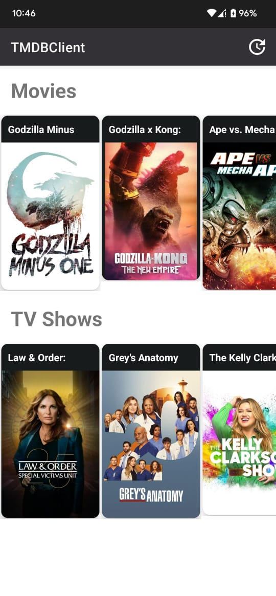

# TMDB Android Client Application
## Description
A simple android project using The Movie DB API.

## How to build on your environment
Replace API key in app/build.gradle file.

## Technologies

- [TheMovieDb(Tmdb) Api](https://developers.themoviedb.org/3)
- [Kotlin](https://kotlinlang.org)
- [ViewModel](https://developer.android.com/topic/libraries/architecture/viewmodel)
- [DataBinding](https://developer.android.com/topic/libraries/data-binding)
- [Coroutines](https://github.com/Kotlin/kotlinx.coroutines)
- [Dagger2](https://dagger.dev)
- [Room](https://developer.android.com/jetpack/androidx/releases/room)
- [Retrofit](https://square.github.io/retrofit/)
